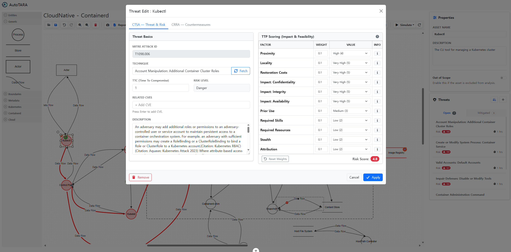

# AutoTARA

<div align="center">
  
  <h1>AutoTARA</h1>
  
  <div>
    
    
    
    
    
    
    
  </div>
</div>

AutoTARA (Automated Threat Analysis and Risk Assessment) is a comprehensive web-based tool designed to streamline the process of threat modeling and risk assessment for automotive cybersecurity. It empowers users to visualize system architectures, identify potential threats, simulate attack vectors, and conduct rigorous risk assessments.

## 🔍 Preview

### 🧩 Visual Threat Modeling
<div align="center">
  
</div>

### 🛡️ CTSA (Cyber Threat Susceptibility Analysis)
<div align="center">
  
</div>

### 📊 CRRA (Cyber Risk Remediation Assessment)
<div align="center">
  
</div>

### ⚔️ Attack Simulation
<div align="center">
  
</div>

## 🚀 Key Features

*   **Visual Threat Modeling:** Build and edit complex system diagrams using an intuitive graph editor powered by AntV X6.
*   **Detailed Property Management:** Configure specific properties for each component and connection within the system.
*   **Threat Management:** Systematically identify, categorize, and manage cybersecurity threats tied to system elements.
*   **Attack Simulation:** Simulate potential attack paths to discover vulnerabilities and validate security assumptions.
*   **Risk Assessment Modules:** Built-in support for standardized assessment methodologies, including CTSA (Cyber Threat Susceptibility Analysis) and CSRA (Cyber Risk Remediation Assessment).
*   **Automated Reporting:** Generate detailed reports on simulations and risk profiles for documentation and compliance.

## 🛠️ Technology Stack

This project is built using a modern full-stack architecture:

### Frontend
*   **Core Framework:** [Vue 3](https://vuejs.org/)
*   **Build Tool:** [Vite](https://vitejs.dev/)
*   **State Management:** [Pinia](https://pinia.vuejs.org/)
*   **Diagram Engine:** [AntV X6](https://x6.antv.vision/)
*   **UI Framework:** [Bootstrap 5](https://getbootstrap.com/) & [FontAwesome](https://fontawesome.com/)

### Backend
*   **Runtime:** Node.js
*   **Framework:** [Express.js](https://expressjs.com/) (v5)
*   **Architecture:** Layered (Controllers, Services, Repositories)

### Database
*   **Database:** PostgreSQL 17
*   **Containerization:** Docker & Docker Compose
*   **Driver:** [node-postgres (pg)](https://node-postgres.com/)

## 📦 Project Setup

### Prerequisites

*   **Node.js** (v20.19.0 or higher recommended)
*   **npm**
*   **Docker Desktop** (for Database)

### Installation & Running

This project consists of three parts: Database, Backend, and Frontend. Follow the steps below to set them up.

#### 1. Database Setup
Start the PostgreSQL database using Docker Compose.

```sh
cd db
docker-compose up -d
```
*   This will start a PostgreSQL container connected to port `5432`.

#### 2. Backend Setup
Install dependencies and start the backend server.

```sh
cd tara.server
npm install
npm run dev
```
*   The server will start on port `4000` (default) or as defined in `.env`.
*   API endpoint: `http://localhost:4000/api`

#### 3. Frontend Setup
Install dependencies and start the frontend application.

```sh
cd tara.vue
npm install
npm run dev
```
*   The application will be accessible at the URL provided by Vite (usually `http://localhost:5173`).

## 🐳 Docker Information

The database is managed via `docker-compose.yml` located in the `db` directory.
*   **User:** `sane`
*   **Database:** `tara_db`
*   **Port:** `5432`
*   **Data Volume:** `pgdata` (persisted locally)

## 👏 Acknowledgements

This project incorporates code and concepts from **[OWASP Threat Dragon](https://github.com/OWASP/threat-dragon)**.
We extend our gratitude to the OWASP community for their significant contributions to open-source threat modeling tools.
Threat Dragon is licensed under the [Apache License 2.0](https://github.com/OWASP/threat-dragon/blob/main/LICENSE).
